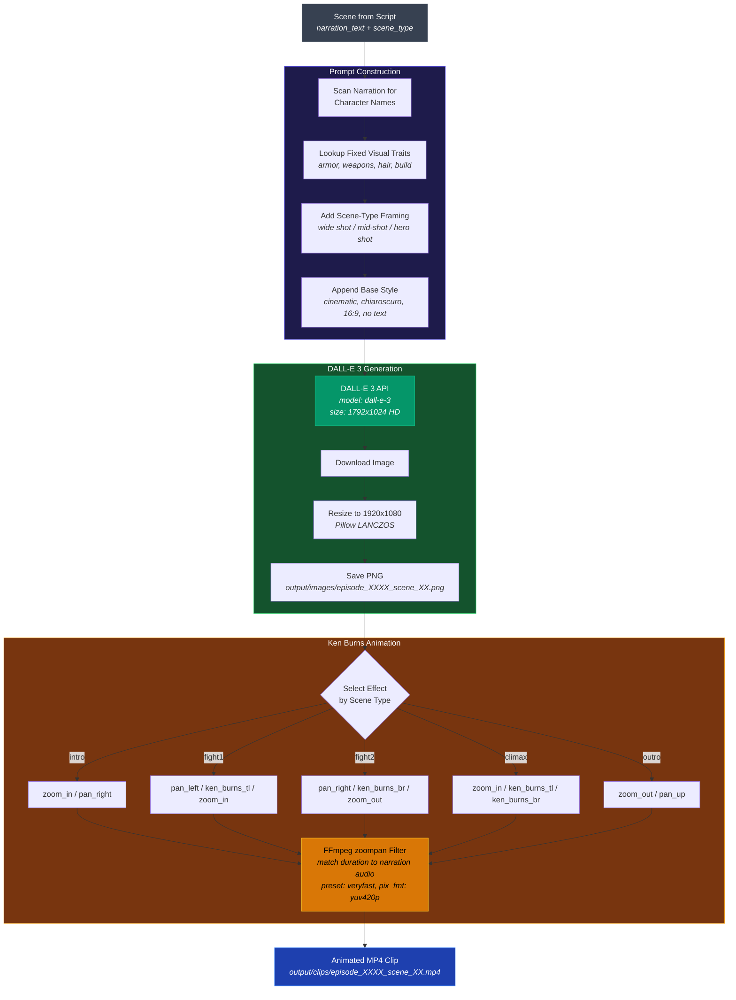
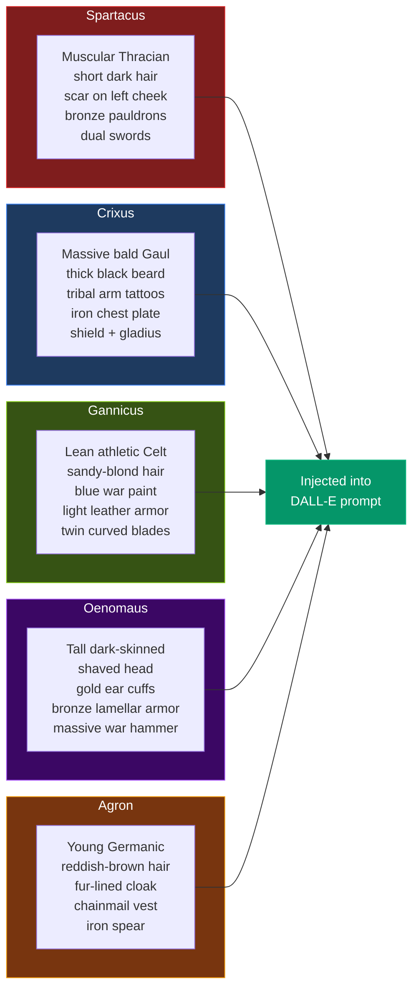
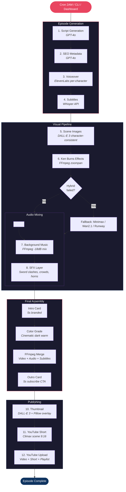
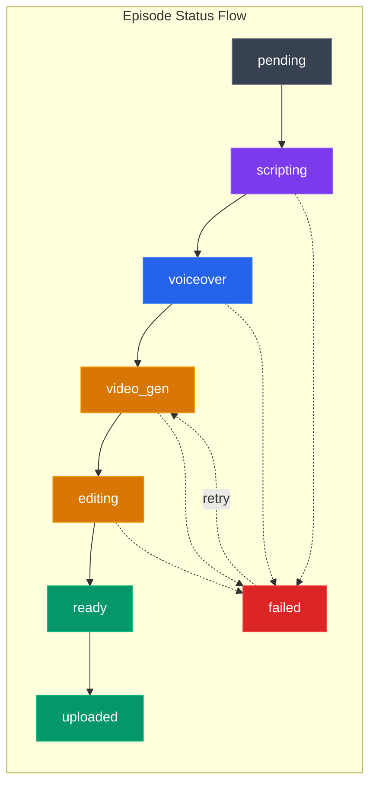
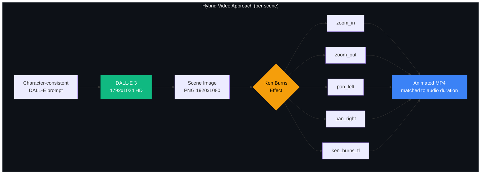
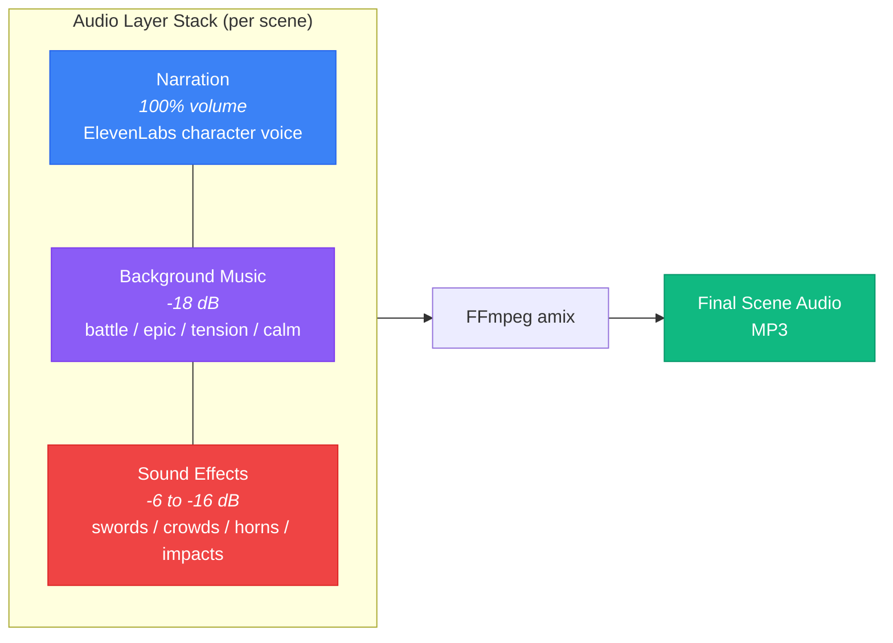

# Spartacus Arena Product Overview

## What This Product Does

`yt-automation` is a fully automated YouTube channel pipeline that creates Spartacus-style gladiator episodes with narrative continuity. It uses a **hybrid approach**: DALL-E generated character-consistent images animated with cinematic Ken Burns pan/zoom effects, layered with per-character AI voiceover, background music, arena sound effects (sword clashes, crowd roars), and subtitles. Optionally uploads everything to YouTube -- all without manual intervention.

## Architecture

### Config Layer (`config/settings.py`)
- Loads `.env` with strict validation at startup
- Fails fast if required keys missing (DB, Redis, OpenAI, ElevenLabs)
- Validates video provider order against known set
- `require_api_keys=False` mode for infra-only contexts (migrations, seeding, web dashboard)
- `reload_settings()` for live config changes without restart
- `update_env_value()` for programmatic `.env` updates

### Persistence Layer (`database/`)
- **Models**: Series, Episode, Scene, Character (with `voice_id`), CharacterStat, VideoJob, JobLog, EpisodeSEO, Short, ApiCostLog
- **Enums**: stored lowercase via `values_callable` to match PostgreSQL enum values
- **Connection**: `session_scope()` context manager, isolated failure logging
- **Migrations**: Alembic with 4 revisions (initial schema + Phase 2 + character voice_id + API cost logs)
- **Seed**: 5 initial characters with ElevenLabs voice assignments

### Generation Pipeline (`pipeline/`)

| Module | Purpose |
|--------|---------|
| `consistency_manager.py` | Story continuity, character results, kill/new character rules |
| `script_generator.py` | GPT-4o script generation with scene structure |
| `seo.py` | GPT-powered YouTube title, description, tags, hashtags |
| `voiceover.py` | ElevenLabs per-scene narration with automatic character voice selection |
| `cost_tracker.py` | Real-time API cost tracking per episode (OpenAI, ElevenLabs, Minimax, Runway) |
| `subtitles.py` | Whisper API transcription to SRT files |
| `image_generator.py` | DALL-E 3 scene images with character-consistent visual descriptions |
| `video_generator.py` | Hybrid (image+Ken Burns), Wan2.1, Minimax, Runway with fallback, intro/outro, color grading |
| `sfx.py` | Arena sound effects (sword clashes, crowd roars, impacts, horns) per scene type |
| `music.py` | Background music mixing per scene type |
| `thumbnail.py` | DALL-E 3 image + Pillow text overlay |
| `shorts.py` | Vertical 9:16 Short from climax scene |
| `youtube_upload.py` | YouTube Data API v3 upload + playlist + chapters + thumbnail |

### Web Dashboard (`web/`)
- **FastAPI + Jinja2 + Tailwind CSS + Video.js** dark theme UI
- Dashboard overview with episode/job/character stats, active pipeline tracker, Wan 2.1 download status
- Episode detail: Video.js player for full episode + per-scene audio/video players + Shorts players
- **Voice management**: per-scene voiceover regeneration with searchable voice selector (Tom Select), per-character voice assignment on Characters page
- Job list + log viewer with status badges, step timeline, and durations
- Character roster with win/loss stats, alive status, and assigned voice
- Generate page with live pipeline progress bar and log polling
- Custom video creation page with per-scene voice selection
- Settings page: API key status, draggable video provider order, Minimax unit price config
- **API cost tracking**: per-episode cost breakdown on detail page, total cost on dashboard with modal breakdown by service
- **Granular retry**: individual retry buttons for Video Gen, Merge, Thumbnail, Shorts, Upload steps
- **Auto-cascade**: retry-video automatically continues through Merge → Thumbnail → Shorts
- **Concurrency locks**: prevents multiple pipeline operations on the same episode
- API endpoints: 30+ REST endpoints (generate, retry, voices, costs, settings, wan21 status)
- Auto-generated API docs at `/docs`

## Full Pipeline Flow

```
 Step  | Pipeline Key | Dashboard Label | Description
-------|-------------|-----------------|--------------------------------------------
 1     | scripting   | Script          | GPT-4o -> Episode + Scenes + Character Results
 2     | seo         | SEO             | GPT-4o -> Optimized title, description, tags, hashtags
 3     | voiceover   | Voiceover       | ElevenLabs -> Per-scene MP3 with character-specific voices
 4     | subtitles   | Subtitles       | Whisper -> Per-scene SRT files
 5     | image_gen   | DALL-E          | DALL-E 3 -> Character-consistent scene images (1792x1024 HD)
 6     | ken_burns   | Ken Burns       | FFmpeg zoompan -> Pan/zoom animation per scene type
 (alt) | video_gen   | Video Gen       | AI video fallback: Minimax / Wan2.1 / Runway
 7     | music       | Music           | FFmpeg -> Background music under narration per scene type
 8     | sfx         | SFX             | FFmpeg -> Sword clashes, crowd roars, impacts, horns
 9     | editing     | Merge           | FFmpeg -> Color grade + intro + normalize + concat + audio + subtitles + outro
 10    | thumbnail   | Thumbnail       | DALL-E 3 + Pillow -> 1280x720 PNG with text overlay
 11    | shorts      | Shorts          | FFmpeg -> 1080x1920 vertical clip from climax scene
 12    | upload      | Upload          | YouTube Data API v3 -> Video + Short + thumbnail + SEO + playlist + chapters
```

Each step is independently retryable from the dashboard Episode Detail page.

### DALL-E Image + Ken Burns Pipeline (per scene)



### Character Visual Consistency

Each character has **fixed visual traits** baked into every DALL-E prompt:



### Ken Burns Effect Reference

| Effect | Motion | Best For |
|--------|--------|----------|
| `zoom_in` | Slowly zoom into center | Intro, climax hero shots |
| `zoom_out` | Start zoomed, pull back | Outro reveal, establishing |
| `pan_left` | Glide right to left | Fight action, tension |
| `pan_right` | Glide left to right | Intro entrance, pursuit |
| `pan_up` | Glide bottom to top | Outro, looking upward |
| `ken_burns_tl` | Zoom + drift to top-left | Dynamic fight close-up |
| `ken_burns_br` | Zoom + drift to bottom-right | Dynamic fight close-up |

## Video Editing Features (Phase 2)

- **Color Grading**: Dark cinematic look via FFmpeg `eq` + `curves` filters (increased contrast, reduced brightness, warm shadows)
- **Intro**: 5-second branded "SPARTACUS ARENA" title card with fade in/out
- **Outro**: 5-second "SUBSCRIBE FOR MORE" call-to-action card with fade
- **Music Mixing**: Scene-type-aware background music at -18dB under narration
- **Subtitle Embedding**: Soft subtitles (mov_text) in final MP4
- **Fast Encoding**: `veryfast` x264 preset, stream-copy where possible
- **Clip Looping**: Video clips auto-loop to match narration duration

## Per-Character Voice System

Each gladiator has a unique ElevenLabs voice assigned in the database:

| Character | Voice | Style |
|-----------|-------|-------|
| Spartacus | Adam (pNInz6...) | Deep, authoritative |
| Crixus | Arnold (VR6Aew...) | Strong, gruff |
| Gannicus | Antoni (ErXwob...) | Youthful, charismatic |
| Oenomaus | Daniel (onwK4e...) | Calm, deep British |
| Agron | Callum (N2lVS1...) | Energetic, intense |

The voiceover generator scans each scene's narration for character names and automatically selects the matching voice. Scenes without character mentions use the default narrator voice.

## Hybrid Video Approach (Primary)

The default video strategy uses **DALL-E generated images + Ken Burns effects**:

1. **Image Generation**: DALL-E 3 creates scene images using character-consistent visual descriptions (each character has fixed appearance traits: armor, weapons, hair, build, etc.)
2. **Ken Burns Motion**: FFmpeg `zoompan` filter applies cinematic camera movements to still images:
   - `zoom_in` / `zoom_out` — slow zoom effects
   - `pan_left` / `pan_right` / `pan_up` — smooth panning
   - `ken_burns_tl` / `ken_burns_br` — combined zoom + pan diagonals
3. **Scene-Type Mapping**: Each scene type (intro, fight, climax, outro) has appropriate effect pools
4. **Audio Layers**: Narration + background music (-18dB) + SFX (sword clashes, crowd roars, impacts)

### Image Provider: DALL-E vs Midjourney

The hybrid pipeline supports two image providers, switchable from the Settings page:

| Provider | Cost/Image | Quality | Speed | API |
|----------|-----------|---------|-------|-----|
| **DALL-E 3** (default) | $0.12 HD | Consistent, detailed | ~10s | OpenAI direct |
| **Midjourney v6.1** | ~$0.05 | Highly stylized | ~30-60s | Proxy (GoAPI) |

**Switch via dashboard**: Settings → Image Provider → click DALL-E or Midjourney.

**Switch via .env**:
```
IMAGE_PROVIDER=midjourney    # or "dall-e"
MIDJOURNEY_ENABLED=true
MIDJOURNEY_API_KEY=your-goapi-key
MIDJOURNEY_API_BASE=https://api.goapi.ai
```

Midjourney prompts append `--ar 16:9 --style raw --v 6.1` automatically for cinematic 16:9 output.

### Cost Comparison

| Provider | Cost/Episode (5 scenes) | Quality | Speed |
|----------|------------------------|---------|-------|
| **Hybrid (Midjourney + Ken Burns)** | ~$0.25 | Highly stylized | ~3-5min |
| **Hybrid (DALL-E + Ken Burns)** | ~$0.60 | Consistent characters | ~30s |
| **Kling AI** (v2.6 Pro) | ~$1.40 | High quality video | ~1min |
| **Kling AI** (v2.6 Std) | ~$0.70 | Good quality video | ~30s |
| Minimax | ~$3.50 | Inconsistent characters | ~5min |
| Runway | ~$1.50 | Variable | ~3min |
| Wan 2.1 (local) | Free | Low quality on M4 | ~10min |

## Video Provider Strategy

Default order: Hybrid -> Minimax -> Kling -> Wan 2.1 -> Runway

Configure via `VIDEO_PROVIDER_ORDER` in `.env` or drag-and-drop in the Settings dashboard page. Valid values: `hybrid`, `wan21`, `minimax`, `runway`, `kling`.

- **Hybrid**: DALL-E or Midjourney images + Ken Burns pan/zoom (default, cheapest, most consistent)
- **Kling AI**: Cloud API (v2.6 Pro/Std, 16:9, 5s/10s clips), $1 free credits on signup — [klingapi.com](https://app.klingai.com/)
- **Minimax**: Cloud API (T2V-01, 720P), configurable unit price
- **Wan 2.1**: Local generation on Apple M4 (MPS), 120 max frames
- **Runway**: Cloud API with polling

### Kling AI Setup

```
KLING_ENABLED=true
KLING_API_KEY=your-kling-api-key
KLING_API_BASE=https://api.klingapi.com
KLING_MODEL=kling-v2.6-pro     # or kling-v2.6-std, kling-v2.5-turbo
```

Available models: `kling-video-o1`, `kling-v2.6-pro` (default, native audio + motion control), `kling-v2.6-std` (fast), `kling-v2.5-turbo` (fastest). Standard mode ~30s, Professional ~60s generation time.

## Sound Effects (SFX)

Arena SFX are automatically layered onto the audio at scene-appropriate positions:

| Category | Used In | Volume |
|----------|---------|--------|
| `sword_clash` | Fight1, Fight2, Climax | -8 to -10 dB |
| `crowd_roar` | Intro, Fight1, Climax | -10 to -16 dB |
| `crowd_cheer` | Fight2, Climax, Outro | -10 to -16 dB |
| `impact` | Fight1, Fight2, Climax | -6 to -8 dB |
| `horn` | Intro, Climax | -8 dB |
| `gate` | Intro | -10 dB |
| `footsteps` | (available) | -12 dB |

Place custom SFX in `assets/sfx/{category}/` as MP3/WAV files. If no files exist, procedural SFX are auto-generated via FFmpeg synthesis.

## Background Music

Place royalty-free MP3/WAV tracks in `assets/music/` subdirectories:
- `tension/` -- intro and general scenes
- `battle/` -- fight scenes
- `epic/` -- climax scenes
- `calm/` -- outro scenes

Music is mixed at -18dB under narration. If no tracks found, narration plays without music.

## Database Status Flows

**Episode**: `pending -> scripting -> voiceover -> video_gen -> editing -> ready -> uploaded`

**VideoJob**: `pending -> running -> ready`

**Scene**: `pending -> voiceover_done -> video_done`

On failure at any step: status set to `failed`, logged via isolated session.

## Story Continuity Rules

- Only alive characters fed into script context
- Last 3 episode summaries included in prompt
- Character results (wins/losses/deaths) persisted per episode
- Kill rule: every 5 episodes (only if > 3 alive characters)
- New character: every 10 episodes
- Grand tournament: every 20 episodes

## Celery Scheduling

| Task | Schedule | Description |
|------|----------|-------------|
| `generate_episode` | Daily 2AM UTC | Generate new episode if <3 ready, auto-retry 3x |
| `upload_next_episode` | Daily 9AM UTC | Upload next ready episode to YouTube |
| `generate_week_batch` | Sunday 1AM UTC | Batch generate 7 episodes, fault-tolerant |
| `retry_failed_jobs` | Every 30 min | Retry failed jobs with backoff (max 3 retries) |

## CLI Commands

```
python cli.py generate         # Trigger one episode generation
python cli.py upload            # Upload next ready episode to YouTube
python cli.py status            # Show recent episodes and statuses
python cli.py characters        # Character roster with voices and stats
python cli.py jobs              # Show recent job status
python cli.py retry --job-id 5  # Retry a specific failed job
python cli.py schedule          # Show Celery beat schedule
python cli.py costs             # Show API cost summary
python cli.py costs --episode-id 1  # Costs for specific episode
python cli.py seed              # Seed initial data
python cli.py open-final-dir    # Print output directory path
```

## YouTube Upload Features

- **Auto-playlist**: Creates/finds "Spartacus Arena Season 1" playlist and adds each video
- **Auto-chapters**: Generates timestamps from scene audio durations
- **AI disclosure**: Mandatory disclosure in video description
- **SEO optimization**: GPT-generated title, description, tags, hashtags
- **Thumbnail**: DALL-E 3 generated + Pillow text overlay, auto-set on upload
- **Shorts**: Separate upload with hashtags and episode link

## Infrastructure

- **Docker**: PostgreSQL 16 + Redis 7, ports bound to localhost only
- **Web**: FastAPI on port 8000 with auto-reload
- **Dependencies**: All pinned in `requirements.txt`

## How To Run (Step by Step)

### Prerequisites

- **Python 3.11+** installed
- **Docker** + **Docker Compose** installed and running
- **FFmpeg** installed (`brew install ffmpeg` on macOS)
- API keys for: OpenAI, ElevenLabs (minimum)

### 1. Clone & Setup Virtual Environment

```bash
cd /Users/Sites/youwaves/yt-automation
python3.11 -m venv .venv311
source .venv311/bin/activate
pip install -r requirements.txt
```

### 2. Configure Environment

```bash
cp .env.example .env
```

Edit `.env` and fill in your API keys:

```
OPENAI_API_KEY=sk-your-key-here
ELEVENLABS_API_KEY=sk_your-key-here
ELEVENLABS_VOICE_ID=your-default-voice-id
MINIMAX_API_KEY=your-minimax-key          # optional
```

### 3. Start Infrastructure (Postgres + Redis)

```bash
docker-compose up -d
```

Verify they're running:

```bash
docker ps   # Should show spartacus_postgres and spartacus_redis
```

### 4. Initialize Database

```bash
.venv311/bin/alembic upgrade head          # Create tables
.venv311/bin/python -m database.seed       # Seed characters + series
```

### 5. Generate Your First Episode

**Option A — CLI (one-shot):**

```bash
.venv311/bin/python cli.py generate
```

**Option B — Web Dashboard:**

```bash
.venv311/bin/uvicorn web.app:app --host 0.0.0.0 --port 8000 --reload
```

Open http://localhost:8000 → click **Generate New Episode**

**Option C — Direct pipeline:**

```bash
.venv311/bin/python main.py
```

### 6. Check Results

```bash
.venv311/bin/python cli.py status          # Episode status
.venv311/bin/python cli.py jobs            # Job status
.venv311/bin/python cli.py costs           # API costs
ls output/final/                           # Final MP4 files
ls output/thumbnails/                      # Thumbnail PNGs
ls output/shorts/                          # YouTube Shorts
```

Or open http://localhost:8000/episodes in the dashboard.

### 7. Enable Full Automation (Optional)

Start Celery worker + beat scheduler in separate terminals:

```bash
# Terminal 1: Worker
.venv311/bin/celery -A scheduler.tasks worker --loglevel=info

# Terminal 2: Beat scheduler
.venv311/bin/celery -A scheduler.tasks beat --loglevel=info
```

This enables:
- **Daily 2AM UTC** → auto-generate episodes
- **Daily 9AM UTC** → auto-upload to YouTube
- **Sunday 1AM UTC** → batch generate 7 episodes
- **Every 30 min** → retry failed jobs

### 8. YouTube Upload (Optional)

1. Create OAuth credentials at https://console.cloud.google.com
2. Download `client_secret.json`
3. Add to `.env`:

```
YOUTUBE_CLIENT_SECRET_PATH=/path/to/client_secret.json
YOUTUBE_UPLOAD_PRIVACY=unlisted
```

4. Run upload (first time opens browser for OAuth):

```bash
.venv311/bin/python cli.py upload
```

---

## Pipeline Flowchart









## Environment Variables

**Required**: `DATABASE_URL`, `REDIS_URL`, `OPENAI_API_KEY`, `ELEVENLABS_API_KEY`, `ELEVENLABS_VOICE_ID`

**Optional**: `MINIMAX_API_KEY`, `MINIMAX_UNIT_PRICE`, `RUNWAY_API_KEY`, `YOUTUBE_CLIENT_SECRET_PATH`, `YOUTUBE_CREDENTIALS_PATH`, `YOUTUBE_UPLOAD_PRIVACY`, `YOUTUBE_PLAYLIST_NAME`, `HF_TOKEN`, `WAN21_MAX_FRAMES`

## Project Structure

```
config/settings.py              -- Environment config + validation + live reload
database/models.py              -- SQLAlchemy ORM models
database/connection.py          -- Session management + helpers
database/migrations/            -- Alembic migrations
database/seed.py                -- Initial data seeder (characters with voices)
pipeline/consistency_manager.py -- Story continuity
pipeline/script_generator.py    -- GPT script generation
pipeline/seo.py                 -- YouTube SEO optimization
pipeline/voiceover.py           -- ElevenLabs narration (per-character voices)
pipeline/subtitles.py           -- Whisper subtitles
pipeline/image_generator.py     -- DALL-E scene images with character consistency
pipeline/video_generator.py     -- Hybrid + AI video providers + Ken Burns + FFmpeg merge + color grade + intro/outro
pipeline/sfx.py                 -- Arena sound effects generation and mixing
pipeline/music.py               -- Background music mixer
pipeline/thumbnail.py           -- DALL-E 3 thumbnails
pipeline/shorts.py              -- YouTube Shorts extractor
pipeline/youtube_upload.py      -- YouTube Data API uploader + playlist + chapters
pipeline/cost_tracker.py        -- API usage cost tracking
web/app.py                      -- FastAPI dashboard (30+ endpoints)
web/templates/                  -- Jinja2 HTML templates (10 pages)
main.py                         -- Pipeline orchestrator
cli.py                          -- Click CLI (11 commands)
scheduler/tasks.py              -- Celery scheduled tasks (4 tasks)
assets/music/                   -- Royalty-free background tracks
assets/sfx/                     -- Sound effects (auto-generated if empty)
output/images/                  -- DALL-E scene images
output/sfx_audio/               -- SFX-mixed audio files
```
